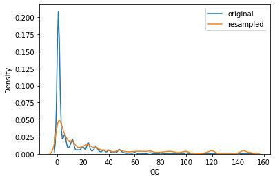

These are the guides to write a document in GitHub. For help, refer to [GitHub doc guide][https://docs.github.com/en/get-started/writing-on-github/getting-started-with-writing-and-formatting-on-github/basic-writing-and-formatting-syntax]

# This is section heading

## This is subsection heading

**This text is bold**

_This text is italicized_

> Text that is a quote

To insert code, use backticks:
```
import numpy
import pandas
```

To insert weblinks use square brackets. For example [google][www.google.com]

To insert image use !, then wrap the caption in square brackets and provide link using curly brackets. For example 

For list use -.
- This is item 1
- This is item 2

For numbered list use 1.
1. This is item 1
2. This is item 2

This is a nested list (use tab to indent and shift+tab to unindent). 
- This is item 1
  - This is item 1.1
    - This is item 1.1.1
- This is item 2.

These are ways to add useful alerts:
> [!NOTE]
> Useful information that users should know, even when skimming content.

> [!TIP]
> Helpful advice for doing things better or more easily.

> [!IMPORTANT]
> Key information users need to know to achieve their goal.

> [!WARNING]
> Urgent info that needs immediate user attention to avoid problems.

> [!CAUTION]
> Advises about risks or negative outcomes of certain actions.

